# Spring Kafka Notifier

## Overview

Spring Kafka Notifier is a production-ready REST API application that dynamically processes Kafka messages and triggers intelligent notifications based on configurable rules. The system features advanced variable substitution, notification throttling to prevent spam, and flexible per-notifier configuration with sensible defaults.

## 🏗️ Architecture Diagram

```mermaid
graph TB
    %% External Systems
    K[Kafka Topics<br/>📨 Messages] --> DKM
    S[Slack Webhooks<br/>💬 Notifications]
    
    %% Main Application
    subgraph "Spring Kafka Notifier Application"
        %% REST Layer
        RC[REST Controller<br/>🌐 API Endpoints] 
        
        %% Service Layer
        DKM[DynamicKafkaMessageProcessor<br/>📊 Message Processing]
        NCS[NotifierConfigurationService<br/>⚙️ Config Management]
        NS[NotificationService<br/>📢 Message Delivery]
        RES[RuleEvaluationService<br/>🔍 Condition Matching]
        NTS[NotificationThrottlingService<br/>🚦 Rate Limiting]
        
        %% Configuration Sources
        subgraph "Configuration Sources"
            R4J[resilience4j.yml<br/>⚙️ Default Settings]
            NC[NotifierConfiguration<br/>📋 Per-Notifier Settings]
        end
        
        %% Data Layer
        M[(MongoDB<br/>💾 Configuration Storage)]
        RLR[RateLimiterRegistry<br/>🔄 Resilience4j]
    end
    
    %% Flow Connections
    K --> DKM
    DKM --> RES
    RES --> NTS
    NTS --> NS
    NS --> S
    
    RC --> NCS
    NCS --> M
    
    DKM --> M
    DKM --> NTS
    
    %% Configuration Flow
    R4J --> NTS
    NC --> NTS
    M --> NC
    
    NTS --> RLR
    
    %% Styling
    classDef external fill:#e1f5fe
    classDef service fill:#f3e5f5
    classDef data fill:#e8f5e8
    classDef config fill:#fff3e0
    
    class K,S external
    class DKM,NCS,NS,RES,NTS service
    class M,RLR data
    class R4J,NC config
```



> **📝 Note**: If you're viewing this on GitHub, the diagram above should render beautifully! If you're viewing in VS Code and the diagram doesn't appear, install the [Mermaid Preview](https://marketplace.visualstudio.com/items?itemName=bierner.markdown-mermaid) extension or refer to the ASCII diagram below.

### ASCII Architecture Diagram (Fallback)
```
┌─────────────────────────────────────────────────────────────────────────────────────────────┐
│                           Spring Kafka Notifier Application                                │
│                                                                                             │
│  ┌──────────────────┐    ┌──────────────────────────────────────────────────────────────┐   │
│  │   REST Layer     │    │                    Service Layer                             │   │
│  │                  │    │                                                              │   │
│  │ REST Controller  │    │  ┌─────────────────┐  ┌─────────────────┐  ┌──────────────┐ │   │
│  │ 🌐 API Endpoints │────┼─▶│ NotifierConfig  │  │ RuleEvaluation  │  │ Notification │ │   │
│  │                  │    │  │ Service ⚙️      │  │ Service 🔍      │  │ Service 📢   │ │   │
│  └──────────────────┘    │  └─────────────────┘  └─────────────────┘  └──────────────┘ │   │
│                          │            │                    │                    │      │   │
│  ┌──────────────────┐    │            ▼                    │                    ▼      │   │
│  │ External Systems │    │  ┌─────────────────┐            │         ┌──────────────┐ │   │
│  │                  │    │  │ DynamicKafka    │◀───────────┼─────────│ Notification │ │   │
│  │ Kafka Topics     │────┼─▶│ MessageProcessor│            │         │ Throttling   │ │   │
│  │ 📨 Messages      │    │  │ 📊              │            │         │ Service 🚦   │ │   │
│  │                  │    │  └─────────────────┘            │         └──────────────┘ │   │
│  │ Slack Webhooks   │◀───┼─────────────────────────────────┼──────────────────────────┼───│
│  │ 💬 Notifications │    │                                 │                          │   │
│  └──────────────────┘    │  ┌─────────────────────────────────────────────────────────┐ │   │
│                          │  │                 Data Layer                              │ │   │
│                          │  │                                                         │ │   │
│                          │  │  MongoDB 💾         RateLimiterRegistry 🔄             │ │   │
│                          │  │  Configuration      Resilience4j                       │ │   │
│                          │  │  Storage                                                │ │   │
│                          │  └─────────────────────────────────────────────────────────┘ │   │
│                          └──────────────────────────────────────────────────────────────┘   │
└─────────────────────────────────────────────────────────────────────────────────────────────┘

Configuration Sources:
├── resilience4j.yml (⚙️ Default Settings)
└── NotifierConfiguration (📋 Per-Notifier Settings)

Flow:
Kafka → DynamicKafkaMessageProcessor → RuleEvaluationService → NotificationThrottlingService → NotificationService → Slack
```

## ✨ Key Features

### 🚀 **Core Functionality**
- **Real-time Kafka Message Processing**: Listens to multiple Kafka topics simultaneously
- **Dynamic Configuration Management**: Runtime updates without application restart
- **MongoDB Integration**: Persistent configuration storage with full CRUD operations
- **RESTful API**: Complete management interface with Swagger/OpenAPI documentation

### 🧠 **Smart Message Processing**
- **Advanced Variable Substitution**: Powerful `${field}` placeholder replacement using Apache Commons Text
- **Flexible Rule Engine**: MongoDB-like query operators for complex condition matching
- **Multi-format Support**: Handles JSON objects, primitive values, and nested data structures

### 🚦 **Notification Throttling (Anti-Spam)**
- **Intelligent Rate Limiting**: Prevents notification flooding using Resilience4j RateLimiter
- **Per-Notifier Configuration**: Custom throttling settings per alert type
- **Fallback Defaults**: Centralized configuration in `resilience4j.yml`
- **Production-Ready**: Thread-safe, high-performance implementation

### 🔧 **Configuration Flexibility**
- **Hybrid Configuration**: Per-notifier settings override system defaults
- **Optional Fields**: Efficient storage with null-safe fallback values
- **Environment-Specific**: Different settings per deployment environment

## 🎯 **Problem Solved**

### **Before**: Traditional alerting systems flood you with duplicate notifications
```
CPU > 80% → Alert sent ✅
CPU > 80% → Alert sent ✅  (1 minute later)
CPU > 80% → Alert sent ✅  (2 minutes later)
CPU > 80% → Alert sent ✅  (3 minutes later)
...📱💥 NOTIFICATION SPAM! 💥📱
```

### **After**: Intelligent throttling prevents spam while keeping you informed
```
CPU > 80% → Alert sent ✅
CPU > 80% → Throttled 🛑  (prevents spam)
CPU > 80% → Throttled 🛑  (prevents spam)
CPU > 80% → Throttled 🛑  (prevents spam)
...⏰ 5 minutes later ⏰
CPU > 80% → Alert sent ✅  (new notification cycle)
```

## 📊 **Configuration Examples**

### 1. **Default Throttling** (Uses resilience4j.yml)
```json
{
  "notifier": "cpu-alert",
  "topic": "system-metrics",
  "rules": {
    "$gt": {
      "$value": 80
    }
  },
  "actions": [{
    "type": "call",
    "params": {
      "provider": "SLACK",
      "webhookURL": "https://hooks.slack.com/services/xxx/yyy/zzz",
      "message": "🚨 CPU usage high: ${value}%"
    }
  }],
  "enabled": true,
  "throttlePeriodMinutes": null,      // Uses default: 5 minutes
  "throttlePermitsPerPeriod": null    // Uses default: 1 notification
}
```
**Result**: Maximum 1 notification per 5 minutes

### 2. **Custom Throttling** (Per-notifier override)
```json
{
  "notifier": "critical-memory-alert",
  "topic": "system-metrics", 
  "rules": {
    "$gt": {
      "$field": "memory",
      "$value": 95
    }
  },
  "actions": [{
    "type": "call",
    "params": {
      "provider": "SLACK",
      "webhookURL": "https://hooks.slack.com/services/xxx/yyy/zzz",
      "message": "🔴 CRITICAL: Memory usage ${memory}%"
    }
  }],
  "enabled": true,
  "throttlePeriodMinutes": 1,         // Custom: 1 minute
  "throttlePermitsPerPeriod": 3       // Custom: 3 notifications
}
```
**Result**: Maximum 3 notifications per 1 minute

### 3. **Variable Substitution Examples**
```json
// Simple value replacement
"message": "CPU: ${value}%"           // "8" → "CPU: 8%"

// Object field replacement  
"message": "CPU: ${cpu}%, Memory: ${memory}%"  // {"cpu":85,"memory":70} → "CPU: 85%, Memory: 70%"

// Nested field replacement
"message": "Server ${server.name} CPU: ${server.metrics.cpu}%"
```

## 📋 **Rule Structure & Data Handling**

### **Standard Rule Structure**
Most rules follow the pattern: `condition → field → value`

```json
{
  "rules": {
    "$gt": {           // ← Condition (greater than)
      "$field": "cpu",   // ← Field: "cpu"
      "$value": 80       // ← Value: 80
    }
  }
}
```

**Message Data**: `{"cpu": 85, "memory": 70, "disk": 45}`  
**Variable Substitution**: `"CPU usage: ${cpu}%"` → `"CPU usage: 85%"`

### **Special Case: Raw Values**
When the Kafka message contains a **raw value** (not a JSON object), use the special `$value` field:

```json
{
  "rules": {
    "$gt": {           // ← Condition (greater than)  
      "$value": 80     // ← Special field for raw values
    }
  }
}
```

**Message Data**: `8` (just a number, not `{"value": 8}`)  
**Variable Substitution**: `"Temperature: ${value}°C"` → `"Temperature: 8°C"`

### **Rule Examples by Data Type**

| Data Type | Kafka Message | Rule | Variable Substitution |
|-----------|---------------|------|----------------------|
| **Raw Number** | `42` | `{"$gt": {"$value": 40}}` | `${value}` → `42` |
| **Raw String** | `"ERROR"` | `{"$eq": {"$value": "ERROR"}}` | `${value}` → `ERROR` |
| **JSON Object** | `{"cpu": 85}` | `{"$gt": {"$field": "cpu", "$value": 80}}` | `${cpu}` → `85` |
| **Nested JSON** | `{"server": {"cpu": 90}}` | `{"$gt": {"$field": "server.cpu", "$value": 85}}` | `${server.cpu}` → `90` |

## 🛠️ Technical Stack

- **Framework**: Spring Boot 3.2.0
- **Language**: Java 21
- **Message Broker**: Apache Kafka
- **Database**: MongoDB
- **Rate Limiting**: Resilience4j
- **Variable Substitution**: Apache Commons Text StringSubstitutor
- **Testing**: JUnit 5, Mockito
- **Documentation**: Swagger/OpenAPI
- **Build Tool**: Maven

## 🚀 Getting Started

### Prerequisites
- Java 21 or higher
- Maven 3.8+
- MongoDB instance
- Apache Kafka cluster
- Slack workspace with webhook permissions

### Installation & Setup

1. **Clone the repository**
   ```bash
   git clone <repository-url>
   cd spring-kafka-notifier
   ```

2. **Configure application properties**
   ```properties
   # MongoDB Configuration
   spring.data.mongodb.uri=mongodb://localhost:27017/notifier_db
   
   # Kafka Configuration  
   spring.kafka.bootstrap-servers=localhost:9092
   spring.kafka.consumer.group-id=notifier-service
   ```

3. **Set up Resilience4j defaults** (Optional - defaults provided)
   ```yaml
   # src/main/resources/resilience4j.yml
   resilience4j:
     ratelimiter:
       configs:
         default:
           limitForPeriod: 1          # 1 notification
           limitRefreshPeriod: 5m     # per 5 minutes
           timeoutDuration: 0s        # fail fast
   ```

4. **Build and run**
   ```bash
   mvn clean install
   mvn spring-boot:run
   ```

5. **Access Swagger UI**
   ```
   http://localhost:8080/spring-kafka-notifier/swagger-ui.html
   ```

## 📡 API Endpoints

### Configuration Management

#### Create Notifier Configuration
```http
POST /spring-kafka-notifier/api/notifier-configurations
Content-Type: application/json

{
  "notifier": "cpu-monitor",
  "topic": "system-metrics",
  "rules": {
    "$gt": {
      "$value": 80
    }
  },
  "actions": [{
    "type": "call",
    "params": {
      "provider": "SLACK",
      "webhookURL": "https://hooks.slack.com/services/XXX/YYY/ZZZ",
      "message": "CPU Alert: ${value}% usage detected!"
    }
  }],
  "enabled": true,
  "description": "Monitor CPU usage and alert when > 80%",
  "throttlePeriodMinutes": 5,
  "throttlePermitsPerPeriod": 1
}
```

#### List All Configurations
```http
GET /spring-kafka-notifier/api/notifier-configurations
```

#### Get Configuration by ID
```http
GET /spring-kafka-notifier/api/notifier-configurations/{id}
```

#### Update Configuration
```http
PUT /spring-kafka-notifier/api/notifier-configurations/{id}
Content-Type: application/json
```

#### Delete Configuration
```http
DELETE /spring-kafka-notifier/api/notifier-configurations/{id}
```

## 🔍 Rule Engine

### Rule Structure Overview

**Standard Rules**: Most rules reference specific fields in JSON objects:
```json
// For JSON message: {"cpu": 85, "memory": 70}
{ "$gt": { "$field": "cpu", "$value": 80 } }  // ← References "cpu" field with $field keyword
```

**Special Case**: For raw values (non-JSON), use the `$value` field:
```json
// For raw message: 8
{ "$gt": { "$value": 80 } }  // ← Uses special $value field
```

### Supported Operators

| Operator | Description | Example |
|----------|-------------|---------|
| `$gt` | Greater than | `{ "$gt": { "$value": 80 } }` or `{ "$gt": { "$field": "cpu", "$value": 80 } }` |
| `$gte` | Greater than or equal | `{ "$gte": { "$field": "memory", "$value": 90 } }` |
| `$lt` | Less than | `{ "$lt": { "$field": "response_time", "$value": 1000 } }` |
| `$lte` | Less than or equal | `{ "$lte": { "$field": "disk", "$value": 95 } }` |
| `$eq` | Equal to | `{ "$eq": { "$value": "error" } }` or `{ "$eq": { "$field": "status", "$value": "error" } }` |
| `$ne` | Not equal to | `{ "$ne": { "$field": "environment", "$value": "test" } }` |
| `$in` | In array | `{ "$in": { "$field": "level", "$values": ["error", "critical"] } }` |
| `$nin` | Not in array | `{ "$nin": { "$field": "source", "$values": ["debug", "trace"] } }` |
| `$regex` | Regular expression | `{ "$regex": { "$field": "message", "$value": ".*exception.*" } }` |
| `$and` | Logical AND | `{ "$and": [{"$gt": {"$field": "cpu", "$value": 80}}, {"$gt": {"$field": "memory", "$value": 70}}] }` |
| `$or` | Logical OR | `{ "$or": [{"$gt": {"$field": "cpu", "$value": 90}}, {"$gt": {"$field": "memory", "$value": 95}}] }` |

### Complex Rule Examples

#### Multiple Conditions (AND)
```json
{
  "$and": [
    { "$gt": { "$field": "cpu", "$value": 80 } },
    { "$gt": { "$field": "memory", "$value": 70 } },
    { "$eq": { "$field": "environment", "$value": "production" } }
  ]
}
```

#### Alternative Conditions (OR)
```json
{
  "$or": [
    { "$gt": { "$field": "cpu", "$value": 95 } },
    { "$gt": { "$field": "memory", "$value": 90 } },
    { "$gt": { "$field": "disk", "$value": 85 } }
  ]
}
```

#### Pattern Matching
```json
{
  "$and": [
    { "$in": { "$field": "level", "$values": ["error", "critical"] } },
    { "$regex": { "$field": "message", "$value": ".*database.*connection.*" } }
  ]
}
```

## 🎨 Variable Substitution

### How It Works
The system uses Apache Commons Text `StringSubstitutor` to replace `${field}` placeholders with actual values from Kafka messages.

### Substitution Examples

#### Simple Value Messages
```json
Kafka Message: "8"
Template: "CPU usage: ${value}%"
Result: "CPU usage: 8%"
```

#### JSON Object Messages
```json
Kafka Message: {"cpu": 85, "memory": 70, "disk": 50}
Template: "System Alert - CPU: ${cpu}%, Memory: ${memory}%, Disk: ${disk}%"
Result: "System Alert - CPU: 85%, Memory: 70%, Disk: 50%"
```

#### Nested Object Messages
```json
Kafka Message: {
  "server": {
    "name": "web-01",
    "metrics": {"cpu": 88, "memory": 75}
  }
}
Template: "Server ${server.name} - CPU: ${server.metrics.cpu}%"
Result: "Server web-01 - CPU: 88%"
```

## 🚦 Throttling Configuration

### Configuration Hierarchy
1. **NotifierConfiguration fields** (highest priority)
2. **resilience4j.yml defaults** (fallback)

### Throttling Examples

#### Default Throttling (resilience4j.yml)
```yaml
resilience4j:
  ratelimiter:
    configs:
      default:
        limitForPeriod: 1      # 1 notification
        limitRefreshPeriod: 5m # per 5 minutes
```

#### Per-Notifier Custom Throttling
```json
{
  "notifier": "critical-alert",
  "throttlePeriodMinutes": 2,     # Custom: 2 minutes
  "throttlePermitsPerPeriod": 3   # Custom: 3 notifications
}
```

#### Mixed Configuration (Partial Override)
```json
{
  "notifier": "warning-alert", 
  "throttlePeriodMinutes": 10,    # Custom: 10 minutes
  "throttlePermitsPerPeriod": null # Default: 1 notification
}
```

## 🧪 Testing

### Run All Tests
```bash
mvn test
```

### Run Specific Test Categories
```bash
# Variable substitution tests
mvn test -Dtest=StringSubstitutorTest,NotificationServiceIntegrationTest

# Throttling tests  
mvn test -Dtest=ThrottlingTest,ConfigurationAwareThrottlingTest

# Rule evaluation tests
mvn test -Dtest=RuleEvaluationServiceTest
```

## 🎯 Use Cases

### 1. **System Monitoring**
Monitor server metrics and alert when thresholds are exceeded:
```json
{
  "notifier": "system-monitor",
  "topic": "server-metrics",
  "rules": {
    "$or": [
      { "$gt": { "$field": "cpu", "$value": 85 } },
      { "$gt": { "$field": "memory", "$value": 90 } },
      { "$gt": { "$field": "disk", "$value": 95 } }
    ]
  },
  "actions": [{
    "type": "call",
    "params": {
      "provider": "SLACK",
      "webhookURL": "https://hooks.slack.com/services/xxx/yyy/zzz",
      "message": "🚨 System Alert - CPU: ${cpu}%, Memory: ${memory}%, Disk: ${disk}%"
    }
  }],
  "throttlePeriodMinutes": 10
}
```

### 2. **Application Error Tracking**
Track application errors and critical issues:
```json
{
  "notifier": "error-tracker",
  "topic": "application-logs",
  "rules": {
    "$and": [
      { "$in": { "$field": "level", "$values": ["ERROR", "CRITICAL"] } },
      { "$eq": { "$field": "environment", "$value": "production" } }
    ]
  },
  "actions": [{
    "type": "call",
    "params": {
      "provider": "SLACK",
      "webhookURL": "https://hooks.slack.com/services/xxx/yyy/zzz",
      "message": "❌ ${level} in ${environment}: ${message}"
    }
  }],
  "throttlePeriodMinutes": 2,
  "throttlePermitsPerPeriod": 5
}
```

### 3. **Business Metrics Alerting**
Monitor business KPIs and trigger alerts:
```json
{
  "notifier": "sales-monitor",
  "topic": "business-metrics",
  "rules": {
    "$or": [
      { "$lt": { "$field": "revenue", "$value": 10000 } },
      { "$lt": { "$field": "conversion_rate", "$value": 0.02 } }
    ]
  },
  "actions": [{
    "type": "call",
    "params": {
      "provider": "SLACK",
      "webhookURL": "https://hooks.slack.com/services/xxx/yyy/zzz",
      "message": "⚠️ Business Alert: Revenue ${revenue}, Conversion Rate ${conversion_rate}"
    }
  }]
}
```

## 🔧 Configuration Model Reference

### NotifierConfiguration Fields

| Field | Type | Required | Description |
|-------|------|----------|-------------|
| `notifier` | String | ✅ | Unique notifier identifier |
| `topic` | String | ✅ | Kafka topic to monitor |
| `rules` | Object | ✅ | Condition rules (MongoDB-like syntax) |
| `actions` | Array | ✅ | Actions to execute when rules match |
| `enabled` | Boolean | ❌ | Enable/disable notifier (default: true) |
| `description` | String | ❌ | Human-readable description |
| `throttlePeriodMinutes` | Long | ❌ | Custom throttling period (null = use default) |
| `throttlePermitsPerPeriod` | Integer | ❌ | Custom permit count (null = use default) |

### Action Configuration

| Field | Type | Required | Description |
|-------|------|----------|-------------|
| `type` | String | ✅ | Action type ("call") |
| `params.provider` | String | ✅ | Notification provider ("SLACK") |
| `params.webhookURL` | String | ✅ | Slack webhook URL |
| `params.message` | String | ✅ | Message template with `${field}` placeholders |

## 🚀 Production Deployment

### Environment-Specific Configuration

#### Development
```yaml
resilience4j:
  ratelimiter:
    configs:
      default:
        limitForPeriod: 10         # More permissive for testing
        limitRefreshPeriod: 1m
```

#### Production
```yaml
resilience4j:
  ratelimiter:
    configs:
      default:
        limitForPeriod: 1          # Strict rate limiting
        limitRefreshPeriod: 5m
```

### Monitoring & Observability

The application exposes metrics through Spring Boot Actuator:
```
http://localhost:8080/spring-kafka-notifier/actuator/metrics
```

Key metrics to monitor:
- Rate limiter metrics
- Kafka consumer lag
- Notification success/failure rates
- MongoDB connection health

## 🤝 Contributing

1. Fork the repository
2. Create a feature branch
3. Write tests for your changes
4. Ensure all tests pass
5. Submit a pull request

## 📝 License

This project is licensed under the MIT License - see the [LICENSE](LICENSE) file for details.

---

## 📞 Support

For questions, issues, or contributions, please:
- Open an issue on GitHub
- Check the [API documentation](http://localhost:8080/spring-kafka-notifier/swagger-ui.html)
- Review the test cases for usage examples

**Built with ❤️ using Spring Boot, Kafka, and modern Java practices**

